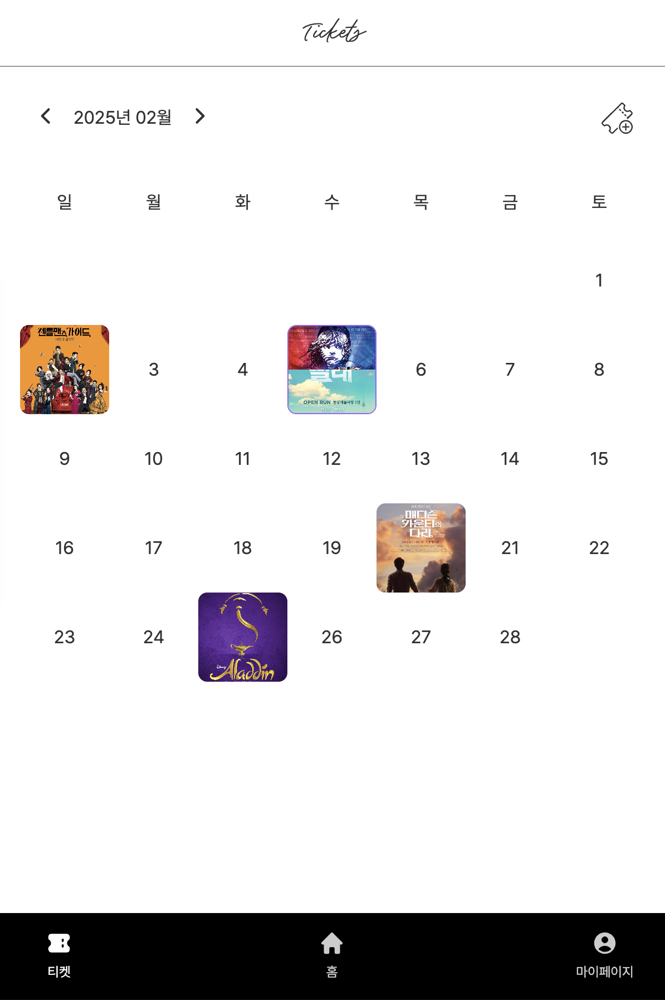
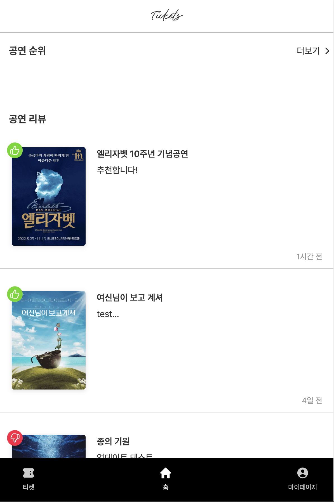
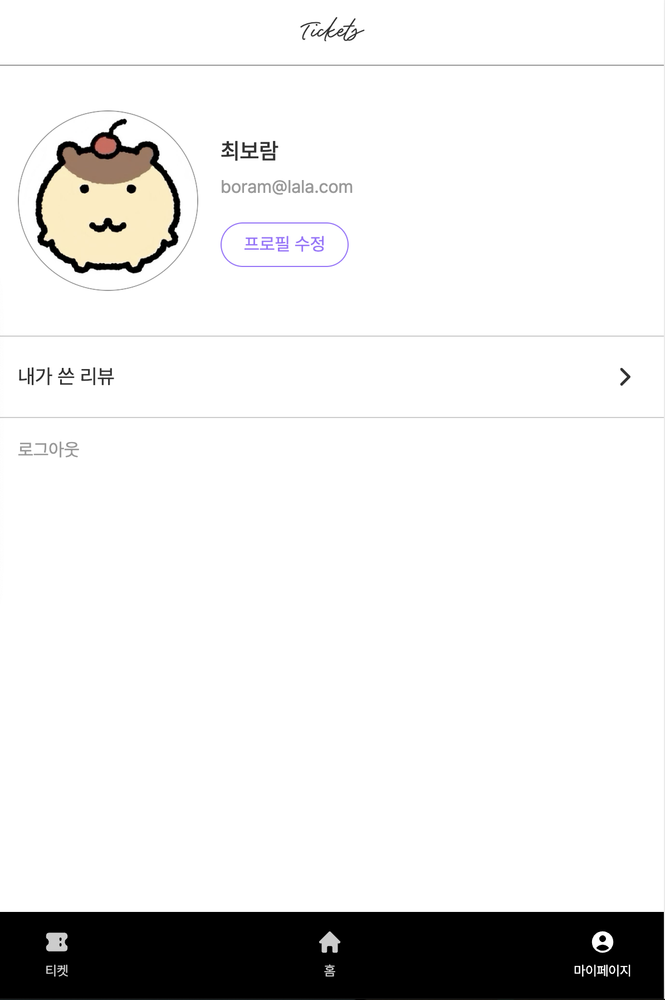

# 🎟️ Tickets v.2

**🔗 서비스 URL:** https://tickets-ten-pi.vercel.app/

**Tickets**는 공연 일정 기록을 위한 서비스로, 공연 정보 조회, 공연 리뷰 작성 등의 기능을 제공합니다.
기존의 서비스를 참고하여 제작되었습니다.

> 기존 React + Firebase 기반 프로젝트를 Next.js, NestJS, Supabase 기반으로 리팩토링한 버전입니다. 👉 [이전 버전](https://github.com/bchoe324/tickets/tree/legacy-main)

## 변경 사항

- **Next.js(App Router) 도입:** 기존 React SPA를 Next.js 기반으로 마이그레이션하여 페이지별 라우팅 및 서버 액션 활용
- **NestJS + Prisma 도입:** RESTful API 서버를 NestJS로 구성하고, Prisma를 통해 PostgreSQL DB와 연동
- **Supabase 사용:** DB, 인증(Auth), 파일 업로드(Storage) 등 BaaS 기능 활용
- **Vercel 배포:** 프론트엔드와 백엔드 모두 Vercel을 통해 배포
- **테스트 로그인 기능 추가:**
- **UX 개선:** 텍스트 및 UI 일부 개선으로 사용자 경험 향상

<br />

## ✨ 주요 기능

- **공연 일정 관리:** 공연 일정을 추가, 조회, 수정, 삭제할 수 있습니다.
- **공연 정보 조회:** 예매 순위 및 상세 정보를 확인할 수 있습니다. (출처: 공연예술통합전산망)
- **공연 리뷰:** 사용자들이 남긴 공연 리뷰를 조회하고, 직접 작성할 수 있습니다.
- **마이페이지:** 프로필을 조회 및 수정할 수 있으며, 내가 작성한 리뷰를 관리할 수 있습니다.
- **회원가입 및 로그인:** Supabase Authentication을 이용하여 이메일로 가입 및 로그인이 가능합니다.

<br />

## 🛠️ 기술 스택

- **Frontend:** Next.js, TypeScript
- **Backend:** NestJs, Prisma
- **Database & Auth**: Supabase (DB, Auth, Storage)

<br />

## 📌 주요 페이지

**1️⃣ 티켓 페이지 🎫**



- 공연 일정을 추가, 조회, 수정, 삭제할 수 있습니다.

<br />

**2️⃣ 홈 페이지 🏠**



- 공연 예매 순위 및 상세 정보를 제공합니다.
- 사용자들이 작성한 공연 리뷰를 확인할 수 있습니다.

<br />

**3️⃣ 마이페이지 👤**



- 사용자 프로필을 조회하고 수정할 수 있습니다.
- 내가 작성한 리뷰 목록을 확인하고, 새 리뷰를 작성할 수 있습니다.

<br />

## 📂 프로젝트 구조

```
📦 tickets
├── 📂 public                # 폰트
├── 📂 src
│   ├── 📂 actions           # 서버 액션
│   ├── 📂 app
│   │   ├── 📂 (auth)        # 로그인, 회원가입 페이지 (공개 라우트)
│   │   ├── 📂 (protected)   # 기타 페이지 (보호 라우트)
│   │   ├── 📜 globals.css   # 공통 CSS 파일
│   │   ├── 📜 layout.tsx    # 공통 레이아웃
│   ├── 📂 assets            # 아이콘
│   ├── 📂 components        # 컴포넌트
│   ├── 📂 constants         # 공통 상수
│   ├── 📂 hooks             # 커스텀 훅
│   ├── 📂 lib               # API 및 DB 호출
│   ├── 📂 utils             # 유틸리티 함수
└── 📜 next.config.js        # Next.js 설정
```
